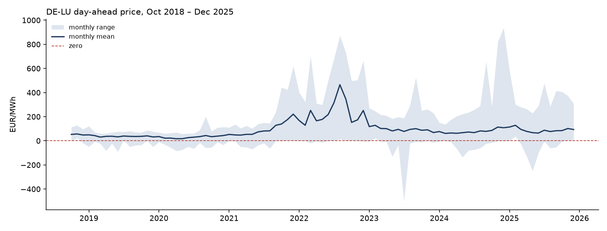
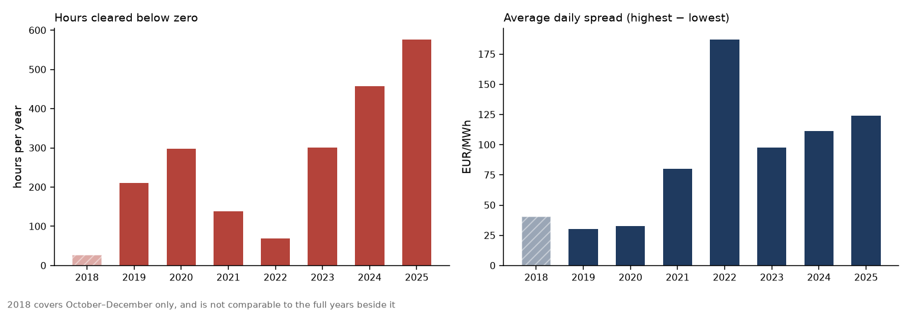
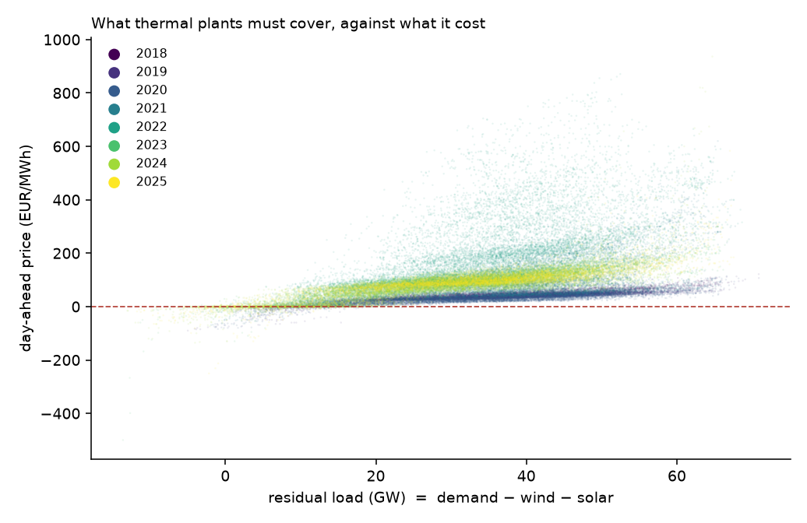

# Battery Storage Backtest

Forecasting German day-ahead electricity prices, and measuring what the forecast is
actually worth to a battery.

**Status:** in progress, started 8 September 2026. No results yet.

---

## The question

A battery earns money by charging when electricity is cheap and discharging when it is
expensive. To do that it has to commit a schedule *before noon on the previous day*,
when tomorrow's prices are still unknown.

So there are two problems: forecast the prices, then decide what to do about them.

This project builds both, and answers one question that gets asked less often than it
should:

> **How much of the achievable revenue does a forecast actually capture — and at what
> point does a better forecast stop being worth anything?**

## Approach

```
ENTSO-E data → features → price forecast → dispatch optimiser → settlement → capture rate
  (known at 11:00 on D-1)              (decision)          (actual prices)
```

Results are reported three ways, so the numbers mean something:

| Run | Forecast used | Tells you |
|-----|--------------|-----------|
| Ceiling | actual prices | what perfect foresight would have earned |
| Model | model output | what this project earned |
| Floor | naive rule | what no modelling effort earns |

**Capture rate = model revenue ÷ ceiling.**

## Where this is going

Six stages. Each one ends on a number, and no stage starts before the previous number exists —
so a claim can always be traced back to the run that produced it.

| Stage | Delivers | Headline number | |
|---|---|---|---|
| 0 | Reproducible data pull, split locked | negative hours, daily spread | **done** 17 Sep 2026 |
| 1 | First model against a naive benchmark | rMAE | **in progress** |
| 2 | LEAR, layout, decomposition | rMAE per variant, DM significance | |
| 3 | Quantile forecasts | pinball loss, coverage | |
| 4 | MILP dispatch optimiser, revenue | **capture rate** | |
| 5 | Drift monitoring, scheduled run | reproducibility | |

Stage 4 is the one the rest exists for. Everything before it makes the capture rate mean
something; without stages 0–3 it would be a number with no provenance.

**Currently:** building `src/features.py`, then the naive benchmark — the same hour one week
earlier — and a first rMAE against it.

## Setup

| | |
|---|---|
| Market | Day-ahead auction, DE-LU bidding zone |
| Target | Hourly clearing price, €/MWh |
| Decision point | 12:00 on day D−1, before gate closure |
| Horizon | 12–36 hours |
| Train / validate / test | Oct 2018 – 2022 / 2023 / 2024–2025 |
| Battery | 1 MW, 2 MWh, 90 % efficiency per direction |

The history starts in October 2018 because the DE-LU bidding zone did not exist before
that date — Germany, Austria and Luxembourg shared a single zone and a single price.

## What the market actually did

Seven years of DE-LU day-ahead prices, 63,577 hours. Regenerate every figure below with
`just explore`.



The average went up and came back. The variation went up and stayed — the shaded band never
returns to its 2019 width. **A battery is paid for the band, not the line.**

Two numbers put a figure on the band.



| Year | Hours below zero | Share | Deepest | Mean daily spread | Days not worth cycling² |
|---|---|---|---|---|---|
| 2018¹ | 27 | 1.2 % | −19 | 40.6 | 2 |
| 2019 | 211 | 2.4 % | −90 | 30.1 | **26** |
| 2020 | 298 | 3.4 % | −84 | 32.5 | 12 |
| 2021 | 139 | 1.6 % | −69 | 80.3 | 2 |
| 2022 | 69 | 0.8 % | −19 | **187.0** | 1 |
| 2023 | 301 | 3.4 % | **−500** | 97.9 | **0** |
| 2024 | 457 | 5.2 % | −135 | 111.2 | **0** |
| 2025 | **576** | **6.6 %** | −250 | 124.1 | 1 |

¹ October to December only.
² Days where the best hour did not beat the cheapest hour by enough to cover round-trip
losses and wear — so the right answer was to stay idle, even knowing the prices in advance.

**Negative hours have risen more than twentyfold** — from 27 in the zone's first quarter to
576 in 2025, when one hour in fifteen cleared below zero. One hour in 2023 reached the
−500 €/MWh floor, the lowest the auction permits.

**The daily spread has roughly quadrupled**, from about 30 €/MWh to about 124. Since a
battery is paid for the spread and nothing else, that is the headline: the opportunity this
project measures is several times larger than it was in 2019.

**The two columns are not the same story twice.** 2025 has more negative hours than 2022
(576 against 69) but a smaller spread (124 against 187). So what produced the spread changed:
in 2022 the expensive hours were extremely expensive; in 2025 the cheap hours are extremely
cheap. **The second kind is worth more**, and the reason is the round-trip loss changing sign.

To deliver 1 MWh, a battery must buy 1 ÷ 0.81 = 1.235 MWh — so the charging price is always
multiplied by 1.235. Against a positive price that works against you; against a negative price
it works for you. Three days with an identical headline spread of 100 €/MWh:

| Charge at | Discharge at | Earned per MWh delivered |
|---|---|---|
| 100 | 200 | 68.5 |
| 0 | 100 | 92.0 |
| −50 | 50 | **103.7** |

Same spread, and half as much again from the third day as the first. A negative hour is worth
more than its face value; an expensive hour has to overcome the loss rather than profit by it.

2021–22 interrupts both columns, and that interruption sits in the middle of the training
period. What caused it is not visible in this data — these files hold prices, load and
weather forecasts, and no fuel or carbon prices at all. The interruption is treated here as
something the model has to survive, not something this repository can explain.

**The last column narrows the question this project has to answer.** In 2019 there were 26
days when a battery with perfect foresight should have stayed idle. Across 2023–2025 there
was one. So *whether* to trade is no longer a real decision — it is always yes. What is left
is **which hours, and how many cycles**, and that is a harder question than the one it
replaced.

### Why the price is what it is

The strongest single driver is **residual load** — demand minus wind and solar, built only
from forecasts published before gate closure. It is what has to be covered by something other
than the weather.

Fitting a straight line through each year separately gives two numbers. The slope says how
many €/MWh one GW of residual load is worth. The correlation says how tightly the two move
together.

| Year | Slope (€/MWh per GW) | Correlation | Hours |
|---|---|---|---|
| 2018¹ | 1.28 | 0.910 | 1,367 |
| 2019 | **1.12** | 0.848 | 8,760 |
| 2020 | 1.16 | 0.828 | 8,784 |
| 2021 | 3.53 | **0.583** | 8,760 |
| 2022 | **7.10** | 0.623 | 8,712 |
| 2023 | 3.09 | 0.883 | 8,759 |
| 2024 | 2.99 | 0.775 | 8,783 |
| 2025 | 3.12 | 0.871 | 8,759 |
| **Pooled** | — | **0.440** | 62,684 |

¹ October to December only.

**The pooled correlation is the weakest number in the table, and that is the finding.** Each
year on its own holds together far better than all of them together. So this is several
relationships stacked, not one relationship scattered — and a model fitted across the whole
record is averaging markets that behaved differently.



**The slope roughly tripled and stayed tripled** — about 1.1 before 2021, about 3.1 since 2023.
One GW of residual load is worth three times what it was in 2019, which is the same as saying
a forecast error of one GW now costs three times as much.

**2021 and 2022 are the two years that fit badly** (0.58 and 0.62), and 2022 is also the
steepest by a distance. In those years something other than residual load was doing much of
the work, and **this dataset cannot say what** — it holds no fuel or carbon prices. Whether to
add them is an open scope question, held until the model shows whether it needs them.

Both awkward years sit inside the training period. The test years fit well and share a slope.
That is the shape of the problem stage 2 has to deal with.

### What negative prices are not

Negative prices are usually explained as wind and solar making more than the country needed.
Mostly they are not:

| Of 2,053 hours that cleared below zero | |
|---|---|
| Wind and solar alone exceeded demand | 424 (**21 %**) |
| Median residual load during those hours | **+5.1 GW** |

Four fifths of the time the system still needed several GW from something else, and the price
went below zero anyway. Something kept generating that would have lost more by stopping
(*must-run generation*).

Naming the cause is beyond this dataset. Counting the hours is not, and the count is enough to
rule out the simple explanation.

## Ground rules

- **Every feature must have been knowable at the decision point.** Published TSO forecasts
  qualify; actual generation does not, however freely available it is today.
- **The test period is evaluated once**, at the end of a stage. Repeated evaluation with
  adjustment in between makes the final number optimistic.
- **Every model faces a benchmark** — the naive rule first, then LEAR from the
  [epftoolbox](https://github.com/jeslago/epftoolbox), with Diebold-Mariano to test whether
  a difference is real.

## Data

| Source | Used for |
|--------|----------|
| [ENTSO-E Transparency Platform](https://transparency.entsoe.eu) | Prices, load forecast, wind and solar generation forecast, actual generation |
| [SMARD.de](https://www.smard.de) | Cross-check, and a fallback while API access is pending |

ENTSO-E API access requires a free account plus a token request. No raw data is committed
to this repository — the pull is reproducible from `src/data.py`.

[docs/data-quality.md](docs/data-quality.md) records what the history actually contains:
coverage per series, the gaps and what was decided about them, and seven hours the client
library silently dropped before anyone counted.

## Running it

Commands live in the [`justfile`](justfile). Run `just` with no argument for the menu.

```bash
brew install just          # or: curl -sSf https://just.systems/install.sh | bash -s -- --to ~/.local/bin

git clone <this repo> && cd battery-storage-backtest
just setup                 # create the venv, install pinned dependencies
just test                  # 101 contract tests — offline, no token needed

cp .env.example .env       # then paste your ENTSO-E token into it
just verify                # confirm the forecast series really are forecasts
just pull                  # download the full history, ~34 MB, about 20 minutes
just explore               # the headline numbers above, and the figures
```

`just pull` fetches the whole history every time and never overwrites what is already
cached. Run it twice and every series reports `unchanged` — that is the reproducibility
check, and it is why a revision on ENTSO-E's side cannot rewrite the data a published
result rested on. Displaced copies are kept under `data/raw/archive/`, and every pull
appends a line to `data/raw/manifest.csv`.

`just` searches parent directories, so any of these work from anywhere in the project. The
same commands are available in VS Code under *Tasks: Run Task*.

Python 3.11.14, pinned in `.python-version`. Dependencies are pinned exactly in
`requirements.txt` — a clean clone resolves to the same versions.

## Structure

[docs/architecture.md](docs/architecture.md) is the map — what each file is for, how they
connect, and where to start reading. In short:

```
BUILT
  src/config.py            split dates, EIC codes, battery parameters — single source of truth
  src/sources/entsoe.py    the data-item catalog: what is fetched, and what may reach a model
  src/data.py              caching and normalisation; the loaders everything else calls
  src/features.py          the gate — where the availability rule is enforced, not declared
  scripts/                 entry points — one per command in the justfile

PLANNED
  src/models.py            training, benchmarks, quantile models
  src/backtest.py          dispatch optimiser and settlement
  src/evaluate.py          rMAE, Diebold-Mariano, pinball loss, capture rate
```

Everything above `features.py` is transport: getting data from ENTSO-E onto disk without
damaging it. Everything below it is a decision. That file is where the question changes from
*"did we fetch this correctly?"* to *"were we allowed to know this?"* — which is why it carries
two independent guards and a test that rebuilds a delivery day from a world truncated at the
auction deadline.

## Scope

**In:** day-ahead prices, Germany, hourly resolution, one battery, one revenue stream.

**Out:** intraday trading, balancing reserve, multiple countries, quarter-hourly modelling.
Each is interesting; each is a separate project.

## Honest framing

Day-ahead price forecasting is not a novel research problem. Every direct marketer and
storage optimiser runs a better version of this, with more data and full-time teams. The
purpose here is a well-built, honestly evaluated implementation — not a new result.

The revenue figures are gross trading margin from day-ahead arbitrage: one revenue stream,
before grid fees, taxes and capital costs. They are not an investment case.

## Licence

Code is MIT licensed — see [LICENSE](LICENSE). This covers the code only; data retrieved
from ENTSO-E remains subject to their own terms of use.
