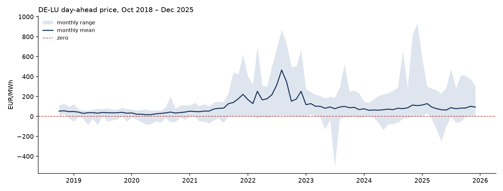
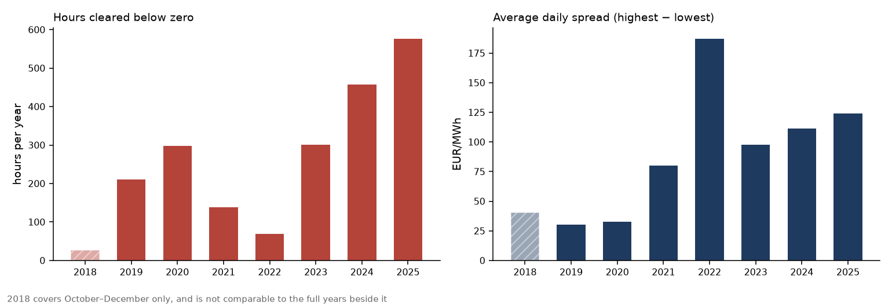
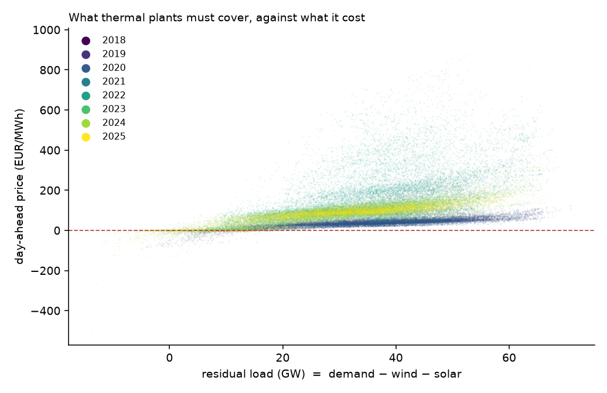

# Battery Storage Backtest

Forecasting German day-ahead electricity prices, and measuring what the forecast is
actually worth to a battery.

**Status:** stage 1 of 6 complete, 30 September 2026. A gradient-boosted tree forecasts the
held-back years at **rMAE 0.532** — roughly half the error of a week-old lookup. Stage 4,
where that becomes a capture rate, is the one the rest exists for.

---

## The question

A battery earns money by charging when electricity is cheap and discharging when it is
expensive. To do that it has to commit a schedule *before noon on the previous day*,
when tomorrow's prices are still unknown.

So there are two problems: forecast the prices, then decide what to do about them.

This project builds both, and answers one question that gets asked less often than it
should:

> **How much of the achievable revenue does a forecast actually capture — and at what
> point does a better forecast stop being worth anything?**

## Approach

```
ENTSO-E data → features → price forecast → dispatch optimiser → settlement → capture rate
  (known at 12:00 on D-1)              (decision)          (actual prices)
```

Results are reported three ways, so the numbers mean something:

| Run | Forecast used | Tells you |
|-----|--------------|-----------|
| Ceiling | actual prices | what perfect foresight would have earned |
| Model | model output | what this project earned |
| Floor | naive rule | what no modelling effort earns |

**Capture rate = model revenue ÷ ceiling.**

## Where this is going

Six stages. Each one ends on a number, and no stage starts before the previous number exists —
so a claim can always be traced back to the run that produced it.

| Stage | Delivers | Headline number | Status |
|---|---|---|---|
| 0 | Reproducible data pull, split locked | negative hours, daily spread | **done** 17 Sep 2026 |
| 1 | First model against a naive benchmark | **rMAE 0.532** | **done** 30 Sep 2026 |
| 2 | Recalibration, LEAR, one model per delivery hour | rMAE per variant, DM significance | next |
| 3 | Quantile forecasts | pinball loss, coverage | |
| 4 | MILP dispatch optimiser, revenue | **capture rate** | |
| 5 | Drift monitoring, scheduled run | reproducibility | |

Stage 4 is the one the rest exists for. Everything before it makes the capture rate mean
something; without stages 0–3 it would be a number with no provenance.

**Why that way round.** A standalone price forecast is close to a commodity — several vendors
sell them and the accuracy differences between them are thin. The margin sits in the two things
on either side of the forecast: the optimisation that turns it into a schedule under real asset
constraints, and the reliability that makes it dependable at 11:45 every morning. That is why
the firms doing this commercially ask for machine learning and optimisation in the same job
description, and it is why a project that stopped at a good rMAE would have measured the least
valuable part.

### Where stage 1 landed

A gradient-boosted tree forecasts the 17,542 held-back hours of 2024–25 with a mean absolute
error of **17.44 €/MWh** against the naive rule's 32.81 — an rMAE of **0.532**. Reproduce it
with `just final-score`; the run is stamped into `reports/scores.csv` with the commit that
produced it.

The more useful result was not the headline. Scored on the validation year the tree beat the
straight-line model, 0.488 to 0.532. On the held-back years, **with the identical recipe, the
ranking reversed** — 0.627 against 0.575. The tree had been chosen partly because it suited
2023, and only years nobody had looked at revealed it. That is the whole apparatus doing its
job, and it is why stage 2 carries a significance test rather than a leaderboard.

### What stage 2 does, in the order the evidence supports

1. **Refit as the year runs.** Measured on validation, refitting monthly instead of once moved
   the tree from 0.488 to 0.440 — a larger gain than any model choice produced. An expanding
   window beat a rolling two-year one, so the lever is *refit more often*, not *forget the
   crisis*.
2. **LEAR**, the field's statistical benchmark. Not beating it would be the interesting result.
3. **One model per delivery hour.** Error spans 7.79 €/MWh between the quietest night hours
   and the 19:00 peak; 3 a.m. and 7 p.m. are different problems sharing one set of
   coefficients.
4. **German public holidays**, which are not in the feature frame at all.
5. **Diebold-Mariano throughout**, because stage 1 demonstrated that a gap of 0.044 on one
   year is not evidence of anything.

### Parked on purpose

Recorded so the reasoning survives, and so nobody re-opens them without new evidence.

| Parked | Until | Why |
|---|---|---|
| **CatBoost, Random Forest** | stage 4 | Both are reported to trade well despite worse error scores — Random Forest for steadier margins, CatBoost in a week-ahead battery-arbitrage comparison. **Capture rate may not rank models the way rMAE does**, and ranking more algorithms on the wrong metric is wasted effort. Stage 4 settles whether the two agree |
| **Experiment tracking (MLflow)** | a run costs more to reproduce than to record | Today a full run takes seconds and is seeded, so nothing can be lost that cannot be regenerated |
| **A second data source for the 37 missing load-forecast days** | closed, not parked | Dropping *all* of 2018 moved the score by nothing, so 888 hours of it cannot matter |

### The plan as a page

The same plan, shareable and refreshed whenever a stage closes:
<https://claude.ai/artifact/Mysse8XGB4exGFykeDcmYm>. This README is canonical; the page is the form
that travels. The version that stood until 2 October is archived unchanged as a dated snapshot and is
not maintained — [docs/worklog.md](docs/worklog.md) records both links and which is which.

### Roughly when

Estimated from what stages 0 and 1 actually took — seven and six working days — rather than
from a wish. Stage 2 and stage 4 are larger: one adds a recalibration loop and a significance
test, the other is a mixed-integer optimiser that does not exist yet.

| Stage | Estimate | Ends around |
|---|---|---|
| 2 | ~2 weeks | mid-October 2026 |
| 3 | ~1 week | late October 2026 |
| 4 | ~2 weeks | mid-November 2026 |
| 5 | ~1 week | late November 2026 |

## Setup

| | |
|---|---|
| Market | Day-ahead auction, DE-LU bidding zone |
| Target | Hourly clearing price, €/MWh |
| Decision point | 12:00 on day D−1, before gate closure |
| Horizon | 12–36 hours |
| Train / validate / test | Oct 2018 – 2022 / 2023 / 2024–2025 |
| Battery | 1 MW, 2 MWh, 90 % efficiency per direction |

The history starts in October 2018 because the DE-LU bidding zone did not exist before
that date — Germany, Austria and Luxembourg shared a single zone and a single price.

## What the market actually did

Seven years of DE-LU day-ahead prices, 63,577 hours. Regenerate every figure below with
`just explore`.



The average went up and came back. The variation went up and stayed — the shaded band never
returns to its 2019 width. **A battery is paid for the band, not the line.**

Two numbers put a figure on the band.



| Year | Hours below zero | Share | Deepest | Mean daily spread | Days not worth cycling² |
|---|---|---|---|---|---|
| 2018¹ | 27 | 1.2 % | −19 | 40.6 | 2 |
| 2019 | 211 | 2.4 % | −90 | 30.1 | **26** |
| 2020 | 298 | 3.4 % | −84 | 32.5 | 12 |
| 2021 | 139 | 1.6 % | −69 | 80.3 | 2 |
| 2022 | 69 | 0.8 % | −19 | **187.0** | 1 |
| 2023 | 301 | 3.4 % | **−500** | 97.9 | **0** |
| 2024 | 457 | 5.2 % | −135 | 111.2 | **0** |
| 2025 | **576** | **6.6 %** | −250 | 124.1 | 1 |

¹ October to December only.
² Days where the best hour did not beat the cheapest hour by enough to cover round-trip
losses and wear — so the right answer was to stay idle, even knowing the prices in advance.

**Negative hours have risen more than twentyfold** — from 27 in the zone's first quarter to
576 in 2025, when one hour in fifteen cleared below zero. One hour in 2023 reached the
−500 €/MWh floor, the lowest the auction permits.

**The daily spread has roughly quadrupled**, from about 30 €/MWh to about 124. Since a
battery is paid for the spread and nothing else, that is the headline: the opportunity this
project measures is several times larger than it was in 2019.

**The two columns are not the same story twice.** 2025 has more negative hours than 2022
(576 against 69) but a smaller spread (124 against 187). So what produced the spread changed:
in 2022 the expensive hours were extremely expensive; in 2025 the cheap hours are extremely
cheap. **The second kind is worth more**, and the reason is the round-trip loss changing sign.

To deliver 1 MWh, a battery must buy 1 ÷ 0.81 = 1.235 MWh — so the charging price is always
multiplied by 1.235. Against a positive price that works against you; against a negative price
it works for you. Three days with an identical headline spread of 100 €/MWh:

| Charge at | Discharge at | Earned per MWh delivered |
|---|---|---|
| 100 | 200 | 68.5 |
| 0 | 100 | 92.0 |
| −50 | 50 | **103.7** |

Same spread, and half as much again from the third day as the first. A negative hour is worth
more than its face value; an expensive hour has to overcome the loss rather than profit by it.

2021–22 interrupts both columns, and that interruption sits in the middle of the training
period. What caused it is not visible in this data — these files hold prices, load and
weather forecasts, and no fuel or carbon prices at all. The interruption is treated here as
something the model has to survive, not something this repository can explain.

**The last column narrows the question this project has to answer.** In 2019 there were 26
days when a battery with perfect foresight should have stayed idle. Across 2023–2025 there
was one. So *whether* to trade is no longer a real decision — it is always yes. What is left
is **which hours, and how many cycles**, and that is a harder question than the one it
replaced.

### Why the price is what it is

The strongest single driver is **residual load** — demand minus wind and solar, built only
from forecasts published before gate closure. It is what has to be covered by something other
than the weather.

Fitting a straight line through each year separately gives two numbers. The slope says how
many €/MWh one GW of residual load is worth. The correlation says how tightly the two move
together.

| Year | Slope (€/MWh per GW) | Correlation | Hours |
|---|---|---|---|
| 2018¹ | 1.28 | 0.910 | 1,367 |
| 2019 | **1.12** | 0.848 | 8,760 |
| 2020 | 1.16 | 0.828 | 8,784 |
| 2021 | 3.53 | **0.583** | 8,760 |
| 2022 | **7.10** | 0.623 | 8,712 |
| 2023 | 3.09 | 0.883 | 8,759 |
| 2024 | 2.99 | 0.775 | 8,783 |
| 2025 | 3.12 | 0.871 | 8,759 |
| **Pooled** | — | **0.440** | 62,684 |

¹ October to December only.

**The pooled correlation is the weakest number in the table, and that is the finding.** Each
year on its own holds together far better than all of them together. So this is several
relationships stacked, not one relationship scattered — and a model fitted across the whole
record is averaging markets that behaved differently.



**The slope roughly tripled and stayed tripled** — about 1.1 before 2021, about 3.1 since 2023.
The eight lines sort into three groups, not eight variations on one market: flat and tight
(2018–20), steep and badly fitting (2021–22), steep and tight again (2023–25).

**What that costs is a transfer problem, not an input problem.** It is not that a wrong
weather forecast now costs more — bids were placed against the *published* forecast, so a
forecast that turns out wrong is settled in the balancing markets, not in this auction. The
cost lands on a model that learned the wrong relationship:

| Fitted on | Asked about an ordinary 40 GW day | |
|---|---|---|
| 2019–20 | says **39 €/MWh** | |
| 2024–25 | answer is **114 €/MWh** | **74 €/MWh of error, before any noise** |

**2021 and 2022 are the two years that fit badly** (0.58 and 0.62), and 2022 is also the
steepest by a distance. In those years something other than residual load was doing much of
the work, and **this dataset cannot say what** — it holds no fuel or carbon prices. Whether to
add them is an open scope question, held until the model shows whether it needs them.

Both awkward years sit inside the training period. The test years fit well and share a slope.
That is the shape of the problem stage 2 has to deal with, and the first model is deliberately
built with no correction for it — so that whatever stage 2 builds has something to beat.

### What negative prices are not

Negative prices are usually explained as wind and solar making more than the country needed.
Mostly they are not:

| Of 2,053 hours that cleared below zero | |
|---|---|
| Wind and solar alone exceeded demand | 424 (**21 %**) |
| Median residual load during those hours | **+5.1 GW** |

Four fifths of the time the system still needed several GW from something else, and the price
went below zero anyway. Something kept generating that would have lost more by stopping
(*must-run generation*).

Naming the cause is beyond this dataset. Counting the hours is not, and the count is enough to
rule out the simple explanation.

## Ground rules

- **Every feature must have been knowable at the decision point.** Published TSO forecasts
  qualify; actual generation does not, however freely available it is today.
- **The test period is evaluated once**, at the end of a stage. Repeated evaluation with
  adjustment in between makes the final number optimistic.
- **Every model faces a benchmark** — the naive rule first, then LEAR from the
  [epftoolbox](https://github.com/jeslago/epftoolbox), with Diebold-Mariano to test whether
  a difference is real.

## Data

| Source | Used for |
|--------|----------|
| [ENTSO-E Transparency Platform](https://transparency.entsoe.eu) | Prices, load forecast, wind and solar generation forecast, actual generation |
| [SMARD.de](https://www.smard.de) | Cross-check, and a fallback while API access is pending |

ENTSO-E API access requires a free account plus a token request. No raw data is committed
to this repository — the pull is reproducible from `src/data.py`.

[docs/data-quality.md](docs/data-quality.md) records what the history actually contains:
coverage per series, the gaps and what was decided about them, and seven hours the client
library silently dropped before anyone counted.

## Running it

**Prerequisite: Python 3.11.** Nothing else. The exact version is pinned in
`.python-version`; anything 3.11.x will do.

### Get it running — three commands, no extra tooling

```bash
git clone <this repo> && cd battery-storage-backtest

python3 -m venv .venv                              # a project-local environment
.venv/bin/pip install -r requirements.txt          # once, not per terminal session
.venv/bin/python -m pytest tests/ -q               # 124 tests, offline, no token
```

That's the whole setup. `pip install` writes into `.venv/` on disk, so it persists — you
never repeat it unless `requirements.txt` changes, and you never need to "activate"
anything, because every command below names the interpreter explicitly.

Expect `108 passed, 16 xfailed`. The sixteen describe functions stage 1 has specified but
not yet written — the test comes first here, so the specification exists before the code
does. They are marked to expect a missing function and *only* a missing function, so a wrong
implementation still fails loudly. Nothing is broken.

### See it work, without a token

```bash
.venv/bin/python -m scripts.explore     # headline numbers and the three figures
```

Needs the cached data — see the next section. Everything above this line runs on a fresh
clone with no account anywhere.

### With an ENTSO-E account

The platform is free; registration takes a day or two because the API token is granted by
hand. Then:

```bash
cp .env.example .env                                 # paste your token into it
.venv/bin/python -m scripts.verify_forecast_series   # ~20 s — are the forecasts forecasts?
.venv/bin/python -m scripts.pull                     # ~20 min, ~34 MB
.venv/bin/python -m scripts.explore                  # now has data to describe
```

### Shorter commands, optional

Those `.venv/bin/python -m ...` invocations are what the [`justfile`](justfile) wraps. If you
install [`just`](https://just.systems), each becomes one word:

```bash
brew install just                  # macOS
pip install rust-just              # any platform, ships the same binary
# or: curl -sSf https://just.systems/install.sh | bash -s -- --to ~/.local/bin

just                               # the menu
just setup · test · pull · verify · explore · train · final-score · clean
```

**Nothing requires it.** The justfile is the single source of truth for what each command is,
so it doubles as documentation — read it and you have the raw commands, which is why they are
not duplicated here to drift out of step. `just` also searches parent directories, so its
recipes work from anywhere in the project, and the same commands appear in VS Code under
*Tasks: Run Task*.

### Why the pull is safe to re-run

It fetches the whole history every time and **never overwrites what is already cached.** Run
it twice and every series reports `unchanged` — that is the reproducibility check made
observable, and it is why a revision on ENTSO-E's side cannot rewrite the data a published
result rested on. Displaced copies are kept under `data/raw/archive/`, and every pull appends
a line to `data/raw/manifest.csv`.

Dependencies are pinned exactly in `requirements.txt`, hand-curated rather than frozen, so a
clean clone resolves to the same versions that produced every number above.

## Structure

[docs/architecture.md](docs/architecture.md) is the map — what each file is for, how they
connect, and where to start reading. In short:

```
BUILT
  src/config.py              split dates, EIC codes, battery parameters — single source of truth
  src/sources/entsoe.py      the data-item catalog: what is fetched, and what may reach a model
  src/data.py                caching and normalisation; the loaders everything else calls
  src/features.py            the gate — where the availability rule is enforced, not declared
  src/models.py              the benchmark, and the two estimators that must beat it
  src/evaluate.py            MAE and rMAE, and the rule that both are scored on the same hours
  scripts/pull.py            just pull        — fetch every series in the catalog
  scripts/explore.py         just explore     — headline numbers and the README figures
  scripts/train.py           just train       — score the validation year, as often as you like
  scripts/final_score.py     just final-score — read the held-back years, once per stage
  reports/scores.csv         every scored run, appended, stamped with its commit

PLANNED
  src/backtest.py            dispatch optimiser and settlement
```

Everything above `features.py` is transport: getting data from ENTSO-E onto disk without
damaging it. Everything below it is a decision. The two scripts at the bottom are split for the
same reason: `train.py` has no code path to the held-back years, and a test enforces it, so
the one reading a stage is allowed stays something you have to mean to do. That file is where the question changes from
*"did we fetch this correctly?"* to *"were we allowed to know this?"* — which is why it carries
two independent guards and a test that rebuilds a delivery day from a world truncated at the
auction deadline.

## Scope

**In:** day-ahead prices, Germany, hourly resolution, one battery, one revenue stream.

**Out:** intraday trading, balancing reserve, multiple countries, quarter-hourly modelling.
Each is interesting; each is a separate project.

**Also out, and worth naming because the distance is the point.** None of the following is
built here, and a backtest is not a system without them:

| What production adds | Why it matters |
|---|---|
| A hard deadline | the forecast exists before 12:00, every day. Usually ready is unusable |
| Fallbacks | when a source is late, something still has to be bid. On 9 September the ENTSO-E API was unreachable for over an hour, and only a second source kept work moving |
| Alerts, not dashboards | a message when coverage or error crosses a threshold, rather than a chart nobody is watching at 11:45 |
| Backfill and versioning | when history is revised, yesterday's decisions stay explainable |
| A named person awake at 11:45 | the part no amount of modelling replaces |

## Honest framing

Day-ahead price forecasting is not a novel research problem. Every direct marketer and
storage optimiser runs a better version of this, with more data and full-time teams. The
purpose here is a well-built, honestly evaluated implementation — not a new result.

The revenue figures are gross trading margin from day-ahead arbitrage: one revenue stream,
before grid fees, taxes and capital costs. They are not an investment case.

And one thing worth keeping in view while building, because it decides what the final number
means. **Accuracy only pays where it changes a decision.** If two forecasts produce the same
battery schedule, the more accurate one earned nothing. So the interesting result at the end
is not the error metric — it is the point where better forecasts stop converting into money.

Stage 1 has already shown the first half of that. The tree beat the straight-line model on
the validation year and lost to it on years nothing had been tuned against, which means a
difference in error that looked real was not. Whether either difference moves a euro is
stage 4's question.

## References

Listed with the claim each one supports, so a reader can check the reasoning rather than
take it on trust. Where this repository states a number, the number comes from a command in
[Running it](#running-it) — these are for the choices around it.

**Method**

| Source | What it supports here |
|---|---|
| Lago, Marcjasz, De Schutter & Weron (2021), *Forecasting day-ahead electricity prices: a review of state-of-the-art algorithms, best practices and an open-access benchmark*, Applied Energy 293 — [ScienceDirect](https://www.sciencedirect.com/science/article/pii/S0306261921004529) · [preprint (PDF)](https://www.dcsc.tudelft.nl/~bdeschutter/pub/rep/21_011.pdf) · doi:10.1016/j.apenergy.2021.116983 | Why LEAR is the benchmark to beat rather than an arbitrary choice, and why the field's default calibration window is a rolling two years rather than all available history |
| [epftoolbox](https://github.com/jeslago/epftoolbox) | The reference implementation of LEAR and DNN that accompanies the paper above |
| Diebold & Mariano (1995), *Comparing Predictive Accuracy* — [paper](https://www.semanticscholar.org/paper/Comparing-Predictive-Accuracy-Diebold-Mariano/1b2e489a0ea4a937b64df59f42509fb043765cbb) | Why a lower average error is not by itself evidence that one forecast beats another: errors run in streaks and move together, so the spread has to be estimated robustly |
| Diebold (2015), *Comparing Predictive Accuracy, Twenty Years Later* — [NBER w18391 (PDF)](https://www.nber.org/system/files/working_papers/w18391/w18391.pdf) | The author's own account of where the test is misapplied — worth reading before using it, not after |
| [Testing for equal predictive accuracy with strong dependence](https://arxiv.org/pdf/2409.12662) | That the test loses power as errors become more dependent, so "not significant" must be read as *cannot tell*, never as *the same* |

**Data**

| Source | What it supports here |
|---|---|
| [ENTSO-E Transparency Platform](https://transparency.entsoe.eu) | Every series in the pull. Terms of use are theirs, which is why no raw data is committed |
| [SMARD.de](https://www.smard.de) | The independent cross-check that confirmed prices to the cent, and the fallback that kept work moving through an API outage |
| [Energy-Charts](https://api.energy-charts.info) | The validated alternative for the 37 load-forecast days ENTSO-E is missing — evaluated in [docs/data-quality.md](docs/data-quality.md) and deliberately not yet adopted |

## Licence

Code is MIT licensed — see [LICENSE](LICENSE). This covers the code only; data retrieved
from ENTSO-E remains subject to their own terms of use.
